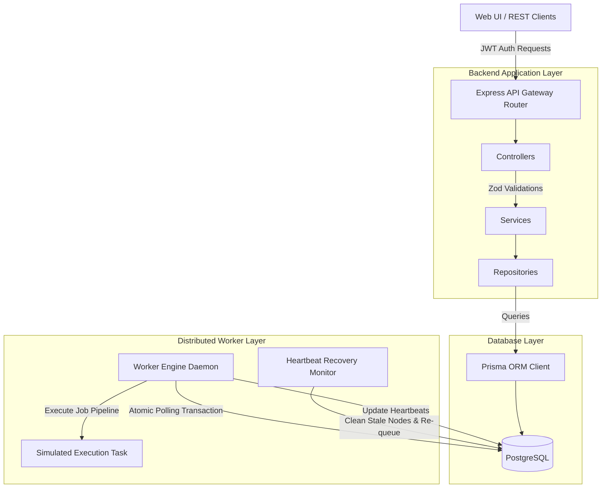
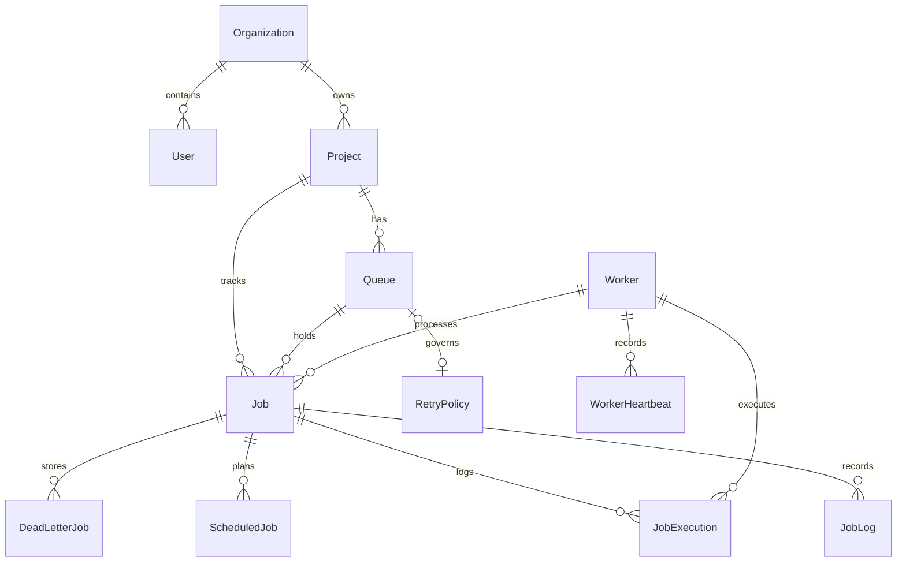

# Architectural Design Decisions

This document outlines the core architectural patterns, database schemas, concurrency locks, and scaling designs selected for the Distributed Job Scheduler (DJS) Platform.

## 1. System Architecture

Below is the modular flow diagram showing client connections, core services, database pools, and worker execution threads:

## 2. Entity-Relationship (ER) Schema

Here is the database relational layout:

## 3. Core Architectural Decisions

### Why the Repository Pattern?
Separating database query calls from service business layers decouples database queries from controllers. This decoupling simplifies replacing the database layer with custom query builders or transitioning to a direct database driver, without modifying services or route logic.

### Why Prisma ORM?
Prisma provides type-safety for our database tables and generates TypeScript typings based on our schema. It handles migrations and relational queries cleanly, preventing common mapping bugs.

### Concurrency Design & Atomic Claiming
To support multiple workers running concurrently without claiming the same task:
1. We run the query and update within a **Prisma Database Transaction** (`$transaction`).
2. We query active job counts for the queue and check that it is less than the queue concurrency limit.
3. If allowed, we find the next eligible task and perform a status transition (`status: 'running'`) update assigned to the `workerId` in the same transaction. This guarantees that only one worker daemon successfully claims a job.
*   *Production Scaling Trade-off*: In a distributed system with hundreds of worker threads, executing locking queries on PostgreSQL can result in transaction serialization bottlenecking. Under massive load, production architectures should deploy a Redis-based broker (e.g. BullMQ) or distributed mutex locks (e.g. Redlock) to isolate claim checks in memory.

### Recovery Monitor & Stale Workers
Worker nodes report heartbeats (CPU, RAM, Timestamp) every 5 seconds to the database. A background `RecoveryMonitor` runs every 10 seconds to detect stale workers (no heartbeat for 30s). When a stale node is detected, the monitor marks it offline and resets any of its `running` jobs back to `queued` so other nodes can process them.
